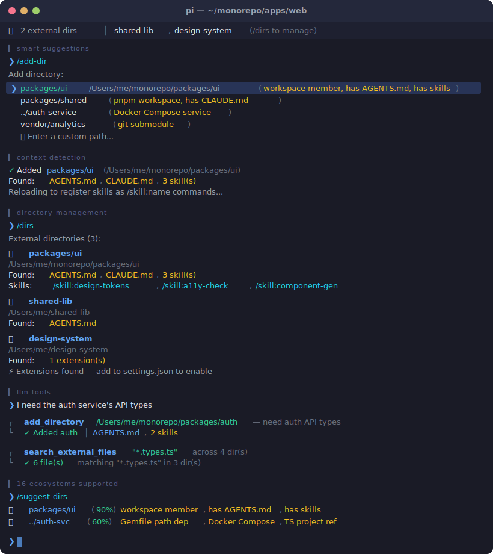

<div align="center">

# pi-add-dir

### Add external directories to your pi session

**[Install](#install)** · **[Usage](#usage)** · **[How it works](#how-it-works)**

</div>

Add directories from outside your current working directory to a pi session. Their `AGENTS.md`, `CLAUDE.md`, and skills are automatically loaded into context every turn — so the agent understands both projects at once.

Skills from external directories are registered natively as `/skill:name` commands via pi's `resources_discover` event.

---

<p align="center">
  
</p>

## Install

```bash
pi install npm:pi-add-dir
```

Or from git:

```bash
pi install https://github.com/itisbryan/pi-add-dir
```

Then `/reload` in pi.

## Usage

### Commands

| Command | Description |
|---------|-------------|
| `/add-dir <path>` | Add an external directory to this session |
| `/add-dir` | Interactive mode — shows smart suggestions based on project structure |
| `/suggest-dirs` | Show all directory suggestions with relevance scores |
| `/remove-dir [path]` | Remove a directory (interactive picker if no path, tab-completion supported) |
| `/dirs` | List all added directories with their detected context |

### Examples

```
/add-dir /Users/me/other-project
/add-dir ../shared-library
/add-dir ~/Desktop/design-system
/dirs
/remove-dir /Users/me/other-project
```

### LLM Tools

Two tools are available for the agent:

| Tool | Description |
|------|-------------|
| `add_directory` | Add an external directory (loads its AGENTS.md, skills, etc.) |
| `search_external_files` | Search for files across all external directories by name/pattern |

The agent can request adding a directory on its own:

> "I need to reference the shared library at /Users/me/libs/core — let me add it to the session."

And search across external dirs when `@` file picker isn't available:

> "Let me search for config files across the external directories."

### Smart Suggestions

When you run `/add-dir` without arguments, the extension analyzes your project structure and suggests relevant directories:

- **Workspace members** — npm, pnpm, Cargo, Go, Python (uv), and monorepo packages
- **Local dependencies** — `file:`/`link:`/`portal:` in package.json, `path:` in Gemfile/Cargo.toml
- **Git submodules** — paths from `.gitmodules`
- **Sibling projects** — related projects alongside your cwd
- **TypeScript project references** — `references` in `tsconfig.json`
- **Docker Compose services** — `build.context` paths
- **Gradle project modules** — `include()` in `settings.gradle(.kts)`
- **Maven multi-module** — `<modules>` in `pom.xml`
- **uv Python workspaces** — `[tool.uv.workspace]` members in `pyproject.toml`
- **.NET solutions** — project references in `.sln` files
- **PHP Composer** — `path` repository references in `composer.json`
- **Flutter/Dart** — `path:` dependencies in `pubspec.yaml`
- **Swift PM** — `.package(path:)` local dependencies in `Package.swift`
- **Elixir** — `{:dep, path: "..."}` in `mix.exs`
- **Context-rich directories** — prioritizes dirs with `AGENTS.md`, `CLAUDE.md`, or skills

Directories with context files get higher relevance scores, making the most useful suggestions appear first.

### Widget

When directories are added, a widget appears above the editor:

```
📂 2 external dirs │ other-project, shared-library  (/dirs to manage)
```

The widget automatically truncates to fit your terminal width.

## How It Works

```
┌─────────────────────────────────────────────────────────┐
│  pi session (cwd: /my-project)                          │
│                                                         │
│  /add-dir /other-project                                │
│     │                                                   │
│     ├─► Scans /other-project for:                       │
│     │     AGENTS.md, CLAUDE.md                          │
│     │     .pi/skills/, .agents/skills/, .claude/skills/ │
│     │     .pi/extensions/ (detection only)              │
│     │                                                   │
│     ├─► Persists to session (survives restart)          │
│     │                                                   │
│     ├─► Registers skills via resources_discover         │
│     │   ~~(auto-reloads pi to activate /skill:name)~~   │
│     │                                                   │
│     └─► Every turn: injects found context files         │
│         into the system prompt via                      │
│         before_agent_start event                        │
│                                                         │
│  Agent now knows both projects' rules & conventions     │
│  Agent can read/edit/write files in /other-project      │
│  using absolute paths (always worked — now it has       │
│  the context to do it intelligently)                    │
│                                                         │
│  Skills from /other-project work as /skill:name         │
│  commands, just like local skills                       │
└─────────────────────────────────────────────────────────┘
```

### What gets injected

For each added directory, the extension reads:

| File | Location(s) checked |
|------|---------------------|
| `AGENTS.md` | `<dir>/AGENTS.md`, `<dir>/.pi/AGENTS.md` |
| `CLAUDE.md` | `<dir>/CLAUDE.md`, `<dir>/.pi/CLAUDE.md` |
| Skills | `<dir>/.pi/skills/*/SKILL.md`, `<dir>/.agents/skills/*/SKILL.md`, `<dir>/.claude/skills/*/SKILL.md` |

Context files are appended to the system prompt on every turn (cached — filesystem is only re-scanned when directories change). Directory listings are intentionally not injected, because ordinary file creation/deletion would otherwise change the system prompt and reduce prompt-cache hits.

Skills are registered natively with pi via the `resources_discover` event, so they appear as `/skill:name` commands with full autocomplete support.

### What's persisted

Added directories are stored in the session via `pi.appendEntry()`. When you `/resume` a session, the directories are automatically restored.

A temp file (`/tmp/pi-add-dir-<hash>.json`) is also maintained so `resources_discover` can read the directory list before the session is fully loaded. This file is automatically synced with session state and cleaned up on `session_shutdown`.

### Extension detection

When adding a directory that contains `.pi/extensions/`, the extension detects them and shows actionable instructions:

```
Found 2 extension(s) in other-project/.pi/extensions/.
   To enable them, add to your settings.json:
   { "extensions": ["/path/to/other-project/.pi/extensions"] }
   Then /reload to activate.
```

Extensions cannot be loaded dynamically at runtime (pi platform limitation), but the extension tells you exactly how to enable them.

### Performance

Context injection is cached — the filesystem is only re-scanned when directories are added or removed, not on every turn. This keeps the `before_agent_start` hook fast.

### Auto-reload behavior

When you add or remove a directory that contains skills, pi automatically reloads (via internal API) to register/unregister those skills as `/skill:name` commands. This is a brief, non-interactive operation — your session state is preserved.

## Limitations

| Works ✅ | Platform limitation ❌ |
|---|---|
| AGENTS.md / CLAUDE.md loaded into system prompt | `@` file fuzzy search doesn't include external dirs¹ |
| Skills registered as native `/skill:name` commands | External `.pi/extensions/` are not auto-loaded² |
| Agent can read/edit/write any path | Can't change `ctx.cwd` at runtime³ |
| Persists across session restarts | |
| File search across external dirs via LLM tool | |
| Extension detection with setup instructions | |

**Notes:**
1. The `@` file picker is a TUI-level feature that can't be extended from an extension. Use the `search_external_files` tool as a workaround — the agent can call it to find files across all external directories.
2. Pi doesn't support loading extensions dynamically at runtime. When extensions are detected, you'll see instructions to add them to `settings.json` manually.
3. `ctx.cwd` is read-only in the pi extension API. The agent uses absolute paths for external directories, which works well in practice.

## Changelog

See [CHANGELOG.md](CHANGELOG.md) for release history.

## License

MIT
